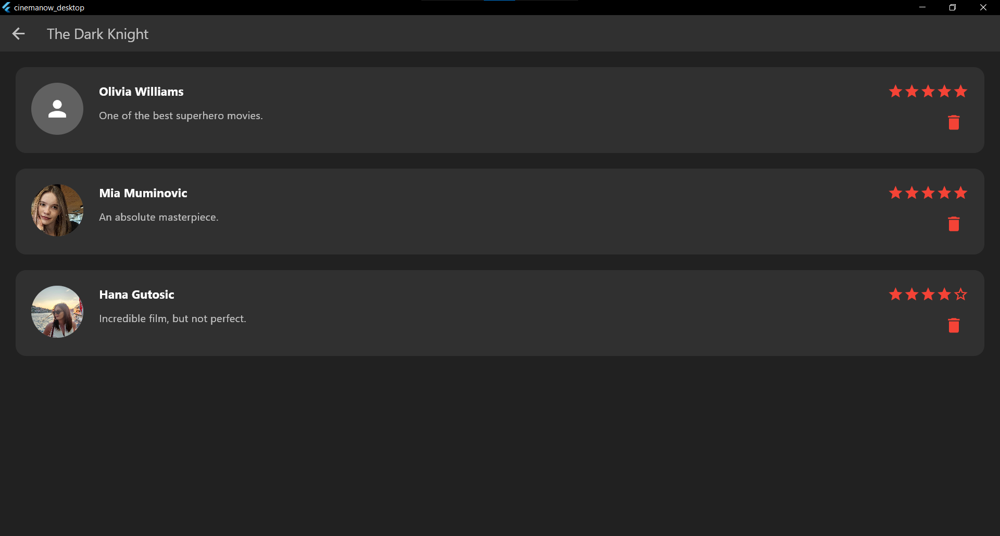
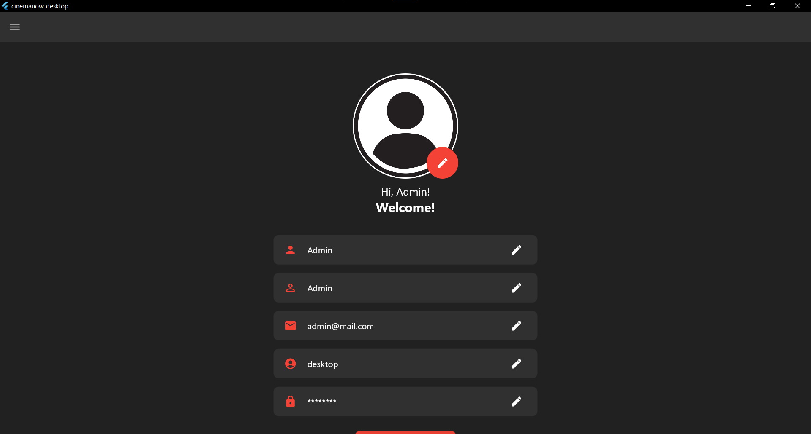
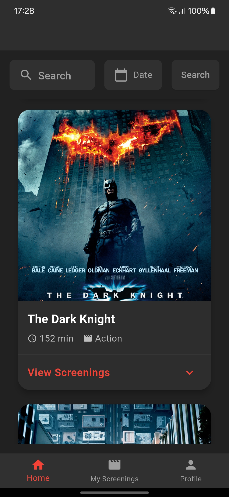

# CinemaNow

This repository contains the code for a cinema app developed as part of the Software Development II course at the Faculty of Information Technologies.

## Overview

- **Backend**: Developed using .NET, providing a comprehensive API for managing cinema-related data.
- **Frontend**: Built with Flutter, with separate interfaces for desktop (admin) and mobile (user) applications.

## Getting Started

To get the app up and running, follow these steps:

1. Clone the repository:

    ```bash
    git clone https://github.com/NedzmijaMuminovic/CinemaNow
    ```

2. Configure Environment Variables:

   - Set up your Stripe Secret key and email app password in your environment with one of these commands:

       ```bash
       # Command Prompt
       set STRIPE_SECRET_KEY=YourSecretKey
       set EMAIL_PASSWORD=YourEmailAppPassword

       # PowerShell
       $env:STRIPE_SECRET_KEY = "YourSecretKey"
       $env:EMAIL_PASSWORD = "YourEmailAppPassword"
       ```

    - Alternatively, use .env files:
        - For the backend, place the .env file in CinemaNow/CinemaNow.
        - For the frontend (mobile app), place it in CinemaNow/CinemaNow/UI/cinemanow_mobile/assets.

3. Run the backend and services using Docker:

    - In the project's root directory (CinemaNow/CinemaNow), use the following command:
      
       ```bash
       docker-compose up --build
       ```

4. Run the frontend:

   - **For Desktop:**
     - Open the Flutter project in Visual Studio Code (CinemaNow/CinemaNow/UI/cinemanow_desktop).
     - Install the necessary dependencies:
       
       ```bash
       dart pub get
       ```
     
     - Run the Flutter app for Windows:
       
       ```bash
       flutter run -d windows
       ```

   - **For Mobile:**
     - Open the Flutter project in Visual Studio Code (CinemaNow/CinemaNow/UI/cinemanow_mobile).
     - Install the necessary dependencies:
       
       ```bash
       dart pub get
       ```
     
     - Connect a physical device or start an emulator.
     - Run the Flutter app for mobile:
       
       - **For an emulator** (if you have an `.env` file configured):
         
         ```bash
         flutter run
         ```
       - **For a physical device** (replacing 192.168.x.x with your device's IP address):
      
         ```bash
         flutter run --dart-define=API_HOST=192.168.x.x
         ```
       - Or, if you prefer to specify your Stripe Publishable Key directly, use:
         
         ```bash
         flutter run --dart-define=STRIPE_PUBLISHABLE_KEY=YourPublishableKey
         ```

## Login Credentials

- **Admin (Desktop app):**
  - Username: desktop
  - Password: test
        
- **User (Mobile app):**
  - Username: mobile
  - Password: test

## Payment Information (for Stripe Testing)
Use the following information for testing Stripe payments:

- **Card Number:** 4242 4242 4242 4242
- **Expiration Date:** Any future date
- **CVC:** Any three-digit number
- **ZIP Code:** Any five-digit number

## Additional Notes
- **Email Notifications:** The app uses RabbitMQ to send an email after successful user registration.
- **Recommender System:** A content-based recommender system is implemented on the movie details screen to display similar movies based on the selected title's attributes.
- **Seed Data:** The seed data includes only 2 sample images to speed up the `docker-compose up` process.

## Screenshots

<details>
  <summary>Desktop Screenshots</summary>

  
  
  
  
  
  
  
  
  
  
  
  
  
  
  

</details>

<details>
  <summary>Mobile Screenshots</summary>

  
  
  
  
  
  
  
  
  
  
  
  
  
  

</details>
    
## License

This project is licensed under the MIT License - see the LICENSE file for details.
